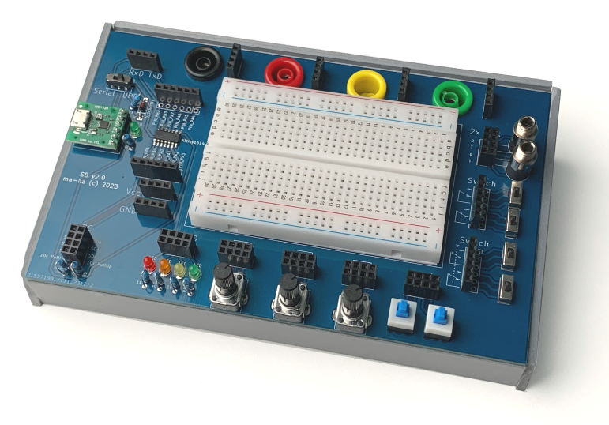

# ATtiny Prototype Board v2

Simplifies circuit prototypying with the ATtiny xx14.

 

Features:
- Beadboard (400 pins)
- I/O
  - 4x LED
  - 3x Potentiometer
  - 2x momentary push button
  - 4x Switch
  - 2x 3.5 mm TRS socket
  - 4x banana socket
  - 2/3x I2C
  - 2x Serial
- ATtiny XX14
- FTDI adapter
  - UPDI programming
  - USB power
  - Serial debugging

Videos:
- Build: https://youtu.be/CmCrIgkOkTU (no talking)
- Description https://youtu.be/84AR5vEIgwg (German)

# Links

- megaTinyCore Core: https://github.com/SpenceKonde/megaTinyCore
- ATtiny xx14 Pinout https://github.com/SpenceKonde/megaTinyCore/blob/master/megaavr/extras/ATtiny_x14.md
- Installation in Arduino IDE: https://github.com/SpenceKonde/megaTinyCore/blob/master/Installation.md

# Release Notes

## v2.0 changes

- use THT LEDs, resistors, diode
- use slide switch: more reliable and visible
- use only socket header

